# Roulette: Conteo, Combinatoria y Probabilidad

[](#)
[](#)

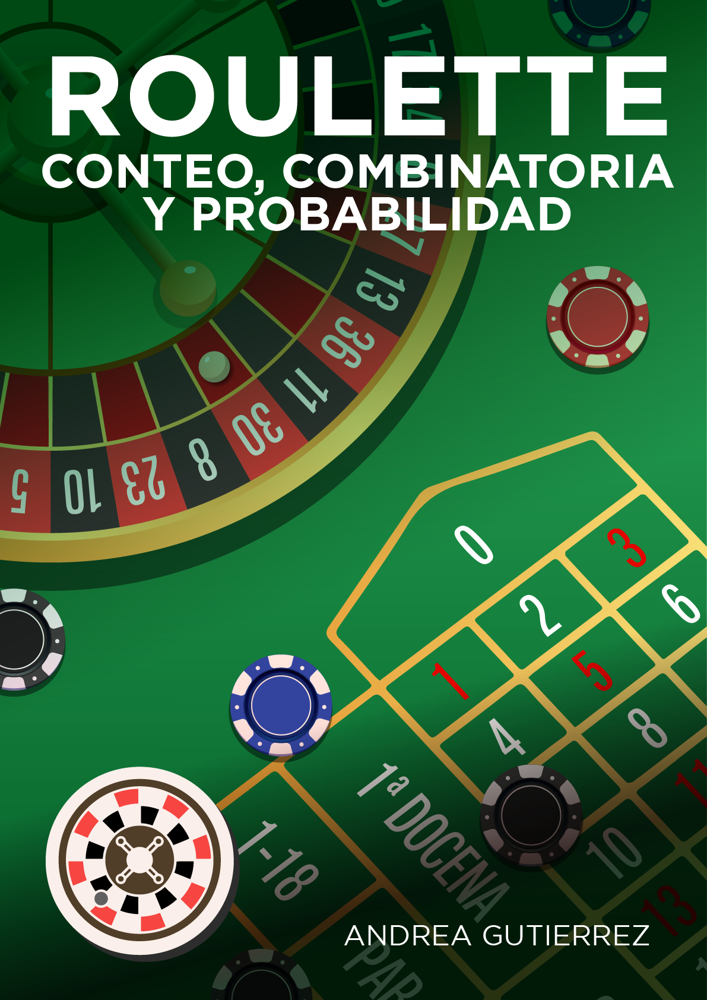

[](#)

## Descripción del proyecto

El proyecto "Roulette: Conteo, Combinatoria y Probabilidad" es una aplicación interactiva basada en el juego de la ruleta, que permite explorar conceptos clave de la matemática discreta, como el conteo, la combinatoria y la probabilidad. Mediante simulaciones y cálculos, los usuarios pueden aprender y experimentar con las probabilidades de diferentes eventos en la ruleta, así como resolver problemas relacionados con el factorial, las permutaciones y las combinaciones.

## Características

- **Simulación de Ruleta:** Una simulación visual de una ruleta interactiva con un balón que gira sobre una rueda, permitiendo observar cómo la bola se detiene en un número específico.
- **Cálculo de Probabilidades:** Permite calcular y verificar la probabilidad de diferentes eventos, como aciertos en una tirada, con formularios de entrada interactivos.
- **Teoría Matemática:** Incluye explicaciones y cálculos sobre temas como el factorial, las permutaciones, las combinaciones y el uso de la fórmula de Pascal para la probabilidad.
- **Interfaz de Usuario:** Interfaz gráfica interactiva construida con Java Swing, con controles para pausar, continuar y visualizar el estado de la ruleta y la probabilidad.

## Requisitos Previos

- Java 17 o superior: Asegúrate de tener Java Development Kit (JDK) instalado en tu sistema.
- **IDE de Java**: Se recomienda usar un entorno de desarrollo como IntelliJ IDEA, Eclipse o NetBeans.

## Instalación

Para instalar el proyecto en tu máquina local, sigue los pasos a continuación:

Clona el repositorio

```bash
git clone https://github.com/GutBla/PROJECT_Roulette_Conteo_Combinatoria_y_Probabilidad.git
```

Accede al directorio del proyecto

```bash
cd PROJECT_Roulette_Conteo_Combinatoria_y_Probabilidad
```

## Uso

Para ejecutar el proyecto, simplemente ejecuta el archivo `Main.java`, que es el punto de entrada principal del programa.

```bash
javac Main.java
```

Luego, ejecuta el proyecto con:

```bash
java Main
```

# Principios Fundamentales del Conteo


## **Principio de Adición**

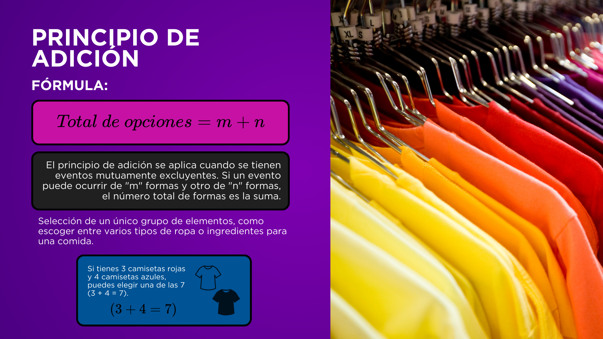

**Definición**: El principio de adición se aplica cuando se tienen eventos mutuamente excluyentes. Si un evento puede ocurrir de "m" formas y otro de "n" formas, el número total de formas es la suma.

**Fórmula**:

$$
\text{Total de opciones} = m + n
$$


**Ejemplo**: Si tienes 3 camisetas rojas y 4 camisetas azules, puedes elegir una de las 7 (3 + 4 = 7).

**Aplicación**: Selección de un único grupo de elementos, como escoger entre varios tipos de ropa o ingredientes para una comida.

### **Principio de Multiplicación**

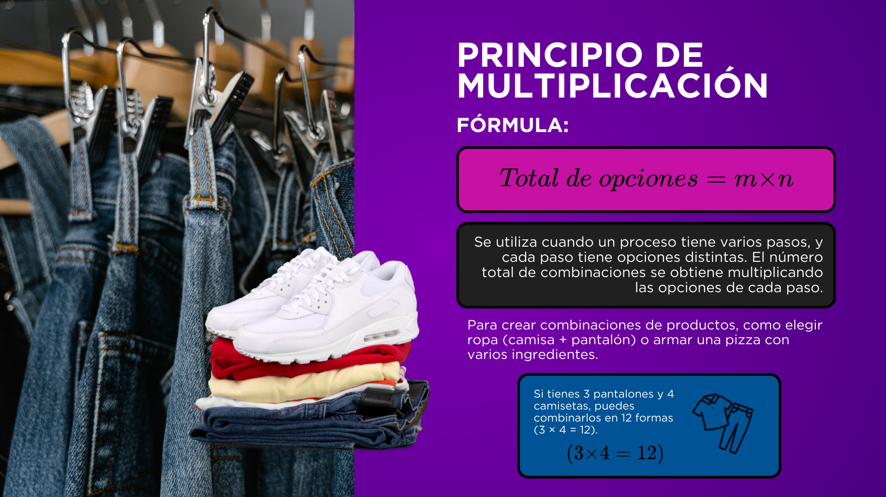

**Definición**: Se utiliza cuando un proceso tiene varios pasos, y cada paso tiene opciones distintas. El número total de combinaciones se obtiene multiplicando las opciones de cada paso.

**Fórmula**:

$$
\text{Total de opciones} = m \times n
$$


**Ejemplo**: Si tienes 3 pantalones y 4 camisetas, puedes combinarlos en 12 formas (3 × 4 = 12).

**Aplicación**: Para crear combinaciones de productos, como elegir ropa (camisa + pantalón) o armar una pizza con varios ingredientes.

### Crea tu Pizza Matemática

El objetivo de este juego es enseñar los principios de adición y multiplicación a través de la creación de pizzas personalizadas. El jugador selecciona el tamaño, tipo de masa y varios ingredientes, y el juego calcula cuántas combinaciones diferentes de pizzas pueden formarse usando el **principio de multiplicación**. Por ejemplo, si hay 3 tamaños, 3 tipos de masa y 5 ingredientes, el número total de combinaciones posibles será 45. Los jugadores pueden experimentar con diferentes combinaciones, aprendiendo de manera interactiva cómo aplicar la lógica combinatoria a situaciones cotidianas.

---

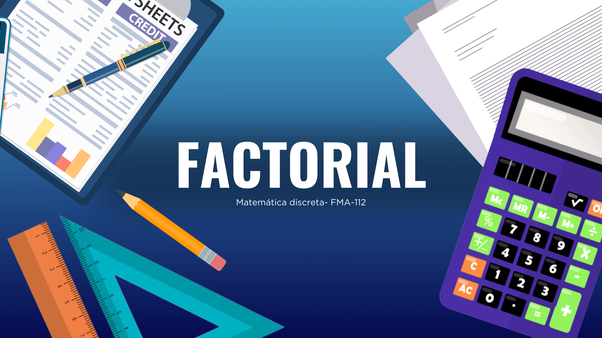

### **Factorial**

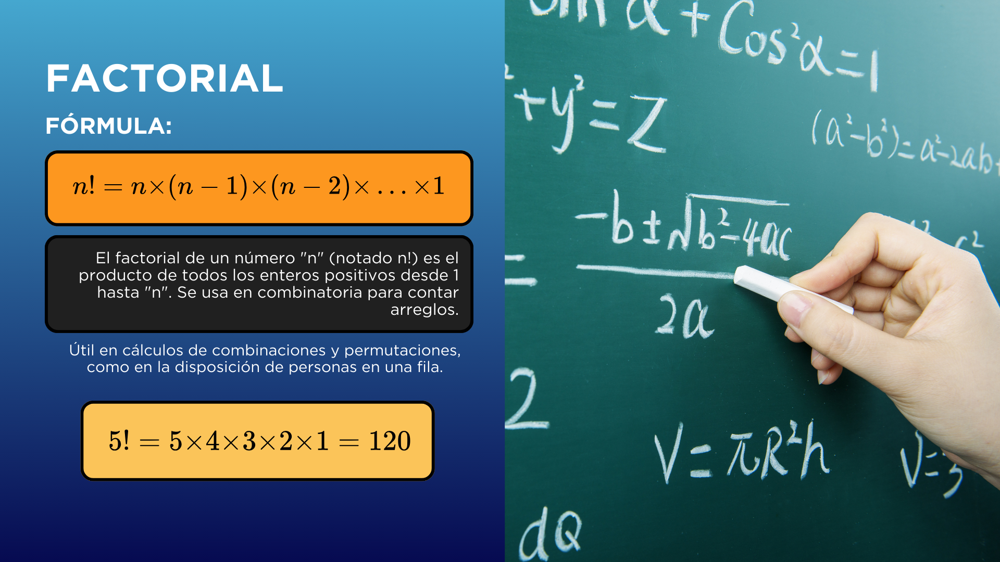

- **Definición**: El factorial de un número "n" (notado \(n!\)) es el producto de todos los enteros positivos desde 1 hasta "n". Se usa en combinatoria para contar arreglos.
- **Fórmula**:

$$
n! = n \times (n - 1) \times (n - 2) \times \ldots \times 1
$$

- **Ejemplo**:

$$
5! = 5 \times 4 \times 3 \times 2 \times 1 = 120
$$

- **Aplicación**: Útil en cálculos de combinaciones y permutaciones, como en la disposición de personas en una fila.

### Adivina el Factorial

Este juego desafía a los jugadores a calcular el factorial de números generados aleatoriamente. Se les presenta un número, como el 5, y deben adivinar su factorial (5! = 120). El jugador ingresa su respuesta y recibe retroalimentación inmediata; si la respuesta es incorrecta, el juego muestra la solución correcta. A través de repetidos intentos, los jugadores fortalecen su comprensión del concepto de factorial y mejoran sus habilidades de cálculo mental de manera divertida y dinámica.

---

# Permutaciones y combinaciones


## **Combinaciones**

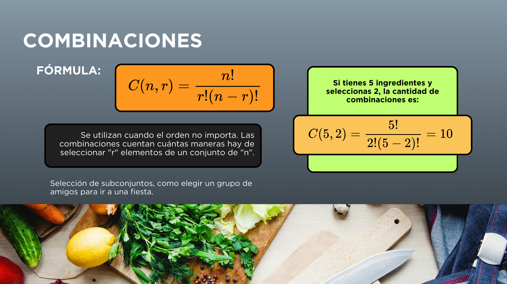

- **Definición**: Se utilizan cuando el **orden no importa**. Las combinaciones cuentan cuántas maneras hay de seleccionar "r" elementos de un conjunto de "n".
- **Fórmula**:

$$
C(n, r) = \frac{n!}{r!(n - r)!}
$$

- **Ejemplo**: Si tienes 5 ingredientes y seleccionas 2, la cantidad de combinaciones es:

$$
C(5, 2) = \frac{5!}{2!(5 - 2)!} = 10
$$

- **Aplicación**: Selección de subconjuntos, como elegir un grupo de amigos para ir a una fiesta.

## **Permutaciones**

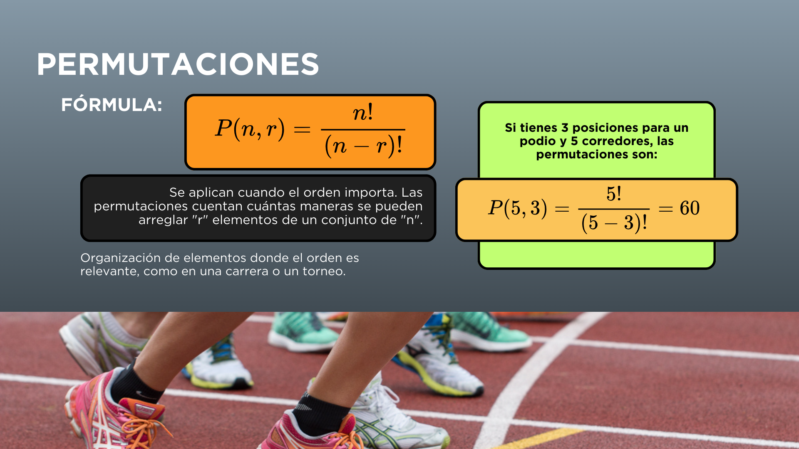

- **Definición**: Se aplican cuando el **orden importa**. Las permutaciones cuentan cuántas maneras se pueden arreglar "r" elementos de un conjunto de "n".
- **Fórmula**:

$$
P(n, r) = \frac{n!}{(n - r)!}
$$

- **Ejemplo**: Si tienes 3 posiciones para un podio y 5 corredores, las permutaciones son:

$$
P(5, 3) = \frac{5!}{(5 - 3)!} = 60
$$

- **Aplicación**: Organización de elementos donde el orden es relevante, como en una carrera o un torneo.

### Permutaciones y Combinaciones"

Este juego permite a los jugadores practicar los conceptos de permutaciones y combinaciones, diferenciando cuándo el orden de los elementos importa y cuándo no. Los jugadores ingresan valores para "n" (número total de elementos) y "r" (número de elementos seleccionados), eligen si quieren calcular una permutación o combinación, y luego resuelven problemas interactivos basados en estos conceptos. A medida que avanzan por los niveles, los problemas se vuelven más desafiantes, ayudando a los jugadores a dominar estos importantes principios combinatorios.

---

# Probabilidad

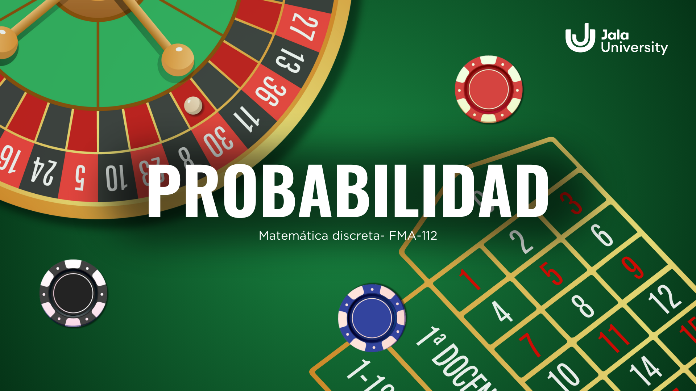

La probabilidad se refiere a la medida de cuán probable es que ocurra un evento en particular. En términos matemáticos, la probabilidad de un evento $A$ es el número de resultados favorables sobre el número total de posibles resultados, dado por la fórmula:

Fórmula básica de probabilidad:

$$
P(A) = \frac{|A|}{|S|}
$$

Donde:

- $P(A)$ es la probabilidad de que ocurra el evento A ,
- $|A|$ es el número de resultados favorables,
- $|S|$ es el número total de resultados posibles en el espacio muestral.

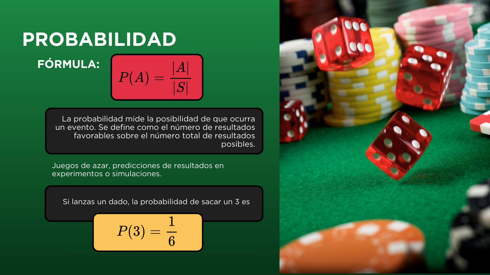

**Ejemplo**: Si lanzas un dado, la probabilidad de sacar un 3 es:

$$
P(3) = \frac{1}{6}
$$

**Aplicación**: Juegos de azar, predicciones de resultados en experimentos o simulaciones.

## **Probabilidad en la Ruleta**

La **ruleta** es un juego de azar en el que hay **37 casillas** (numeradas del 0 al 36). Cada giro de la ruleta produce un resultado independiente y, en términos probabilísticos, podemos aplicar los conceptos de **sucesos complementarios** y **sucesos excluyentes** para analizar los resultados.

### **Tipos de Apuestas y sus Probabilidades**

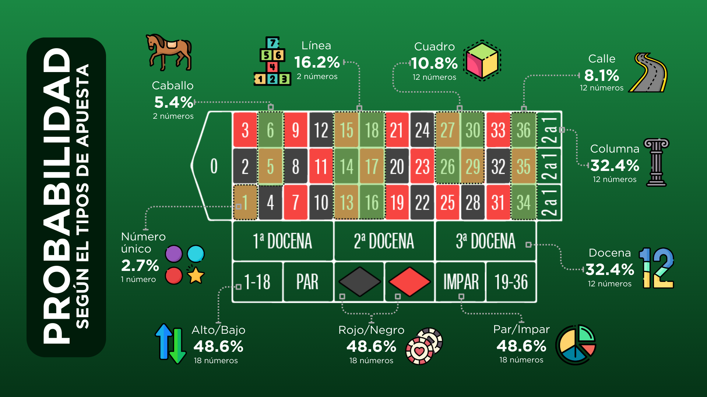

Apuestas comunes y la probabilidad asociada a cada una:

- **Probabilidad de que salga rojo o negro:** En la ruleta europea, hay 18 números rojos y 18 números negros. El 0 no cuenta como ninguno. La probabilidad de que salga un número rojo o negro es:

$$
P(\text{Rojo}) = \frac{18}{37} \approx 0.486 = 48.6\%
$$

$$
P(\text{Negro}) = \frac{18}{37} \approx 0.486 = 48.6\%
$$

- **Probabilidad de números pares o impares**: Existen 18 números pares y 18 números impares. El 0 no se incluye en esta categoría. Las probabilidades son:

$$
P(\text{Impar}) = \frac{18}{37} \approx 0.486 = 48.6\%
$$

$$
P(\text{Par}) = \frac{18}{37} \approx 0.486 = 48.6\%
$$

- **Probabilidad de números altos (19-36) o bajos (1-18):** Al igual que las anteriores, hay 18 números altos (19-36) y 18 números bajos (1-18). Nuevamente, el 0 no se incluye:

$$
P(\text{Número alto}) = \frac{18}{37} \approx 0.486 = 48.6\%
$$

$$
P(\text{Número bajo}) = \frac{18}{37} \approx 0.486 = 48.6\%
$$

- **Probabilidad de docenas**: Los números están agrupados en tres docenas (1-12, 13-24, 25-36). La probabilidad de que la bola caiga en una docena específica es:

$$
P(\text{Docena}) = \frac{12}{37} \approx 0.324 = 32.4\%
$$

- **Probabilidad de columnas:** En la ruleta hay tres columnas, cada una de las cuales contiene 12 números. La probabilidad de que salga un número de una columna específica es:

$$
P(\text{Columna}) = \frac{12}{37} \approx 0.324 = 32.4\%
$$

- **Probabilidad de línea (6 números):** La apuesta en línea se realiza en un grupo de 6 números (dos filas de 3 números cada una). Hay 6 apuestas en una línea.

$$
P(\text{Línea}) = \frac{6}{37} \approx 0.162 = 16.2\%
$$

- **Probabilidad del cuadro (4 números):** El cuadro (o "corner") consiste en apostar en un grupo de 4 números que comparten una esquina. Cada cuadro cubre 4 números.

$$
P(\text{Cuadro}) = \frac{4}{37} \approx 0.108 = 10.8\%
$$

- **Probabilidad del calle (3 números):** La apuesta en calle consiste en apostar en 3 números en una fila vertical. Cada calle cubre 3 números.

$$
P(\text{Calle}) = \frac{3}{37} \approx 0.081 = 8.1\%
$$

- **Probabilidad del caballo (2 números) :** La apuesta de caballo consiste en apostar en dos números adyacentes. Cada caballo cubre 2 números.

$$
P(\text{Caballo}) = \frac{2}{37} \approx 0.054 = 5.4\%
$$

- **Pleno (Número Único)**: Apostar a un solo número tiene una baja probabilidad de éxito, ya que la ruleta tiene 37 números posibles (del 1 al 36 más el 0). La probabilidad de que salga un número específico es:

$$
P(\text{Número único}) = \frac{1}{37} \approx 0.027 = 2.7\%
$$

### Tabla de Probabilidades


| Tipo de Apuesta | Fórmula | Probabilidad |
| --- | --- | --- |
| Número único | $\frac{1}{37}$ | 2.7% |
| Rojo/Negro | $\frac{18}{37}$ | 48.6% |
| Par/Impar | $\frac{18}{37}$ | 48.6% |
| Alto/Bajo | $\frac{18}{37}$ | 48.6% |
| Docena | $\frac{12}{37}$ | 32.4% |
| Columna | $\frac{12}{37}$ | 32.4% |
| Línea | $\frac{6}{37}$ | 16.2% |
| Cuadro | $\frac{4}{37}$ | 10.8% |
| Calle | $\frac{3}{37}$  | 8.1% |
| Caballo | $\frac{2}{37}$ | 5.4% |

### **Gráfico: Probabilidad de Tipos de Apuesta en la Ruleta**

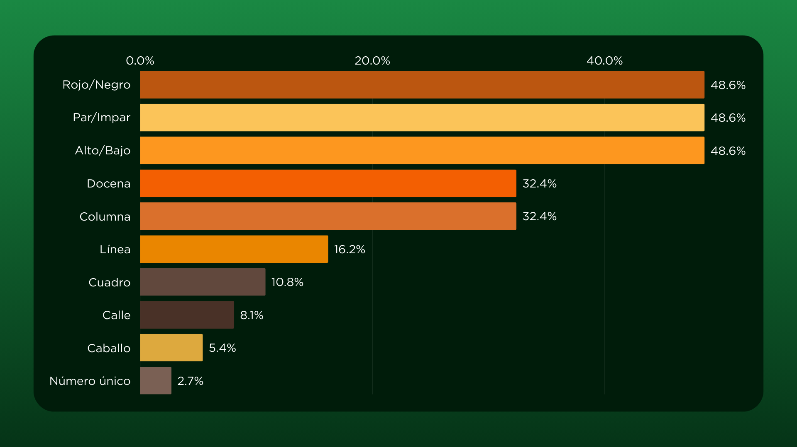

## Falacia del jugador

La falacia del jugador es el error de creer que eventos pasados en juegos de azar afectan las probabilidades de eventos futuros, cuando en realidad cada evento es independiente. Esto lleva a tomar decisiones equivocadas, como pensar que, tras varios resultados repetidos, un resultado diferente es más probable, cuando las probabilidades siguen siendo las mismas.

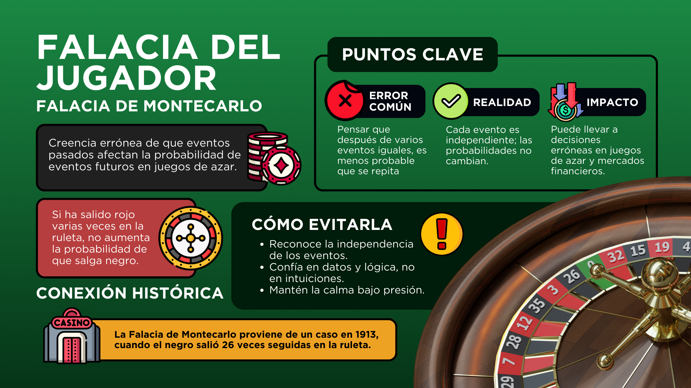

## **Distribución Binomial**

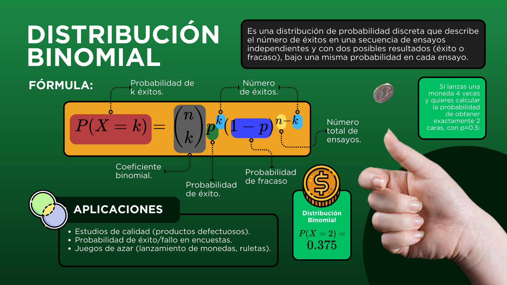

La **distribución binomial** se puede aplicar para modelar la probabilidad de obtener un número determinado de éxitos (aciertos) en un número fijo de tiradas. Cada tirada es un ensayo con dos resultados posibles: acierto o fallo.

La función de probabilidad de la distribución binomial está dada por:

$$
P(X = k) = \binom{n}{k} p^k (1-p)^{n-k}
$$

Donde:

- $n$= número de tiradas
- $k$= número de éxitos (aciertos)
- $p$ = probabilidad de éxito en cada tirada (acierto en la ruleta)
- $\binom{n}{k}$ es el coeficiente binomial.
- $(1 - p)$  es la probabilidad de no acertar,

La probabilidad de acertar **10 o más veces** en 337 tiradas es del **42.7%**.

### **Coeficiente Binomial**

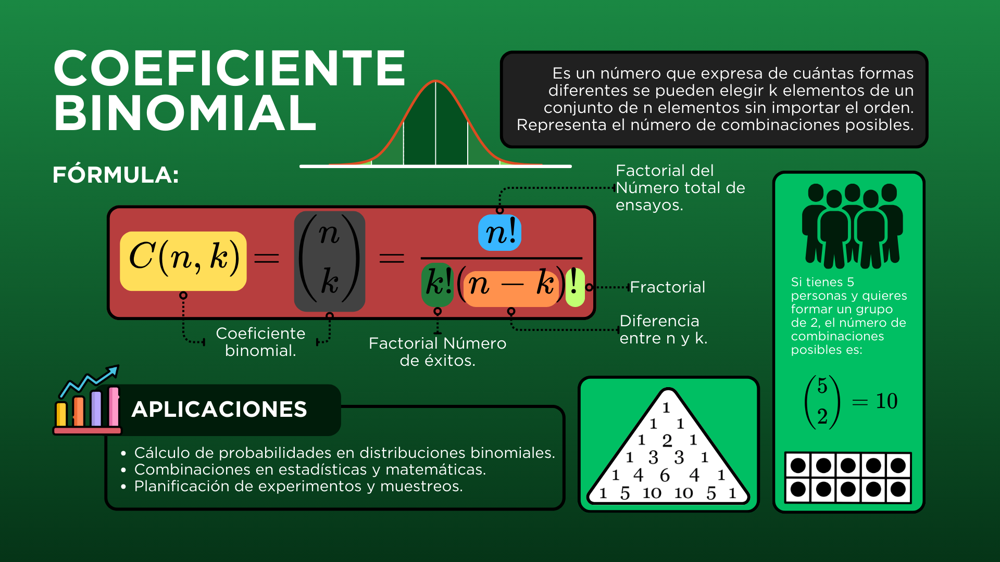

El coeficiente binomial, denotado como $\binom{n}{k}$, nos dice cuántas formas diferentes hay de seleccionar k aciertos en n intentos. La fórmula del coeficiente binomial es:

$$
\binom{n}{k} = \frac{n!}{k!(n-k)!}
$$

### **Probabilidad de Aciertos en n Tiradas**

Si jugamos **10 tiradas** de la ruleta, y queremos calcular la probabilidad de acertar exactamente **3 veces** en esas tiradas, podemos aplicar la fórmula binomial. Primero calculamos el coeficiente binomial:

$$
\binom{10}{3} = \frac{10!}{3!(10-3)!}= \frac{10 \times 9 \times 8 \times \cancel{7!}}{3!\times\cancel{7!}} = \frac{10 \times 9 \times 8}{3 \times 2 \times 1} = 120
$$

Supongamos que apostamos a un número específico en la ruleta (donde la probabilidad de acierto en una tirada es $p = \frac{1}{37} \approx 0.027$). Calcular la probabilidad de acertar exactamente **3 veces** en **10 tiradas**.

$$
P(X = 3) = \binom{10}{3} \cdot 0.027^3 \cdot (1 - 0.027)^{10-3}
$$

$P(X = 3) = 120 \cdot 0.027^3 \cdot (0.973)^7$

$P(X = 3) \approx 120 \cdot 1.97 \times 10^{-5} \cdot 0.834$

$P(X = 3) \approx 0.00195$

$P(X = 3) \approx 0.195\%$

La probabilidad de acertar exactamente **3 veces** en **10 tiradas** es aproximadamente **0.195%**.

Para calcular la probabilidad de acertar exactamente **1 vez** en **10 tiradas** de la ruleta, aplicamos nuevamente la fórmula de la **distribución binomial**.

$$
\binom{10}{1} = \frac{10!}{1!(10-1)!} = \frac{10 \times 9!}{1! \times 9!} = \frac{10}{1} = 10
$$

- La probabilidad de acertar en una tirada es $p = \frac{1}{37} \approx 0.027$.
- La probabilidad de no acertar en una tirada es $1 - p = 0.973$.

Utilizamos la fórmula de la distribución binomial para obtener la probabilidad de acertar exactamente **1 vez** en **10 tiradas**:

$$
P(X = 1) = \binom{10}{1} \cdot 0.027^1 \cdot (0.973)^{10 - 1}
$$

$P(X = 1) = 10 \cdot 0.027 \cdot 0.782 \approx 0.211$

La probabilidad de acertar exactamente **1 vez** en **10 jugadas** es aproximadamente **21.1%**.

### **Tabla de Probabilidades para Diferentes Números de Aciertos en 10 Tiradas**

| Número de Aciertos (k) | Coeficiente Binomial $(\binom{10}{k})$ | Probabilidad de Acierto $p^k$ | Probabilidad de No Acierto $(1-p)^{10-k}$ | Probabilidad Total $P(X = k)$ |
| --- | --- | --- | --- | --- |
| 0 | $\binom{10}{0} = 1$ | $0.027^0 = 1$ | $0.973^{10} \approx 0.761$ | $P(X = 0) \approx 76.1\%$ |
| 1 | $\binom{10}{1} = 10$ | $0.027^1 = 0.027$ | $0.973^9 \approx 0.782$ | $P(X = 1) \approx 21.1\%$ |
| 2 | $\binom{10}{2} = 45$ | $0.027^2 \approx 0.000729$ | $0.973^8 \approx 0.803$ | $P(X = 2) \approx 2.64\%$ |
| 3 | $\binom{10}{3} = 120$ | $0.027^3 \approx 1.97 \times 10^{-5}$ | $0.973^7 \approx 0.826$ | $P(X = 3) \approx 0.195\%$ |
| 4 | $\binom{10}{4} = 210$ | $0.027^4 \approx 5.31 \times 10^{-7}$ | $0.973^6 \approx 0.849$ | $P(X = 4) \approx 0.0095\%$ |
| 5 | $\binom{10}{5} = 252$ | $0.027^5 \approx 1.43 \times 10^{-8}$ | $0.973^5 \approx 0.872$ | $P(X = 5) \approx 0.00032\%$ |
| 6 | $\binom{10}{6} = 210$ | $0.027^6 \approx 3.87 \times 10^{-10}$ | $0.973^4 \approx 0.896$ | $P(X = 6) \approx 0.000007\%$ |
| 7 | $\binom{10}{7} = 120$ | $0.027^7 \approx 1.05 \times 10^{-11}$ | $0.973^3 \approx 0.921$ | $P(X = 7) \approx 0.0000001\%$ |
| 8 | $\binom{10}{8} = 45$ | $0.027^8 \approx 2.84 \times 10^{-13}$ | $0.973^2 \approx 0.947$ | $P(X = 8) \approx 0.000000001\%$ |
| 9 | $\binom{10}{9} = 10$ | $0.027^9 \approx 7.66 \times 10^{-15}$ | $0.973^1 \approx 0.973$ | $P(X = 9) \approx 0.000000000007\%$ |
| 10 | $\binom{10}{10} = 1$ | $0.027^{10} \approx 2.07 \times 10^{-16}$ | $0.973^0 = 1$ | $P(X = 10) \approx 0.00000000000002\%$ |


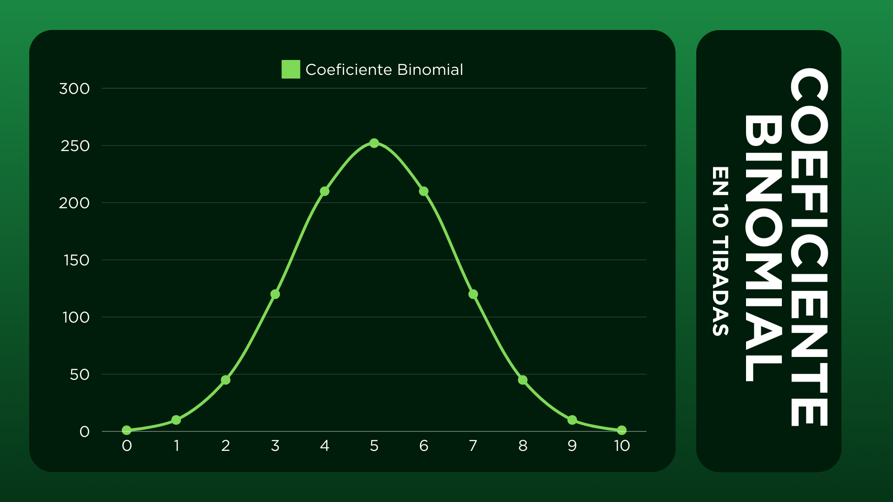

### **Probabilidad de No Acierto en n Jugadas**

La probabilidad de **no acertar en una tirada** es $1 - p$, donde $p = \frac{1}{37} \approx 0.027$. Por lo tanto, la probabilidad de no acertar en una tirada es:

$$
P(\text{no acierto en una tirada}) = 1 - 0.027 = 0.973
$$

La probabilidad de no acertar en **n tiradas** seguidas sería:

$$
P(\text{ningún acierto en } n \text{ tiradas}) = (0.973)^n
$$

### **Probabilidad de No Acierto en n Jugadas**

La probabilidad de **no acertar en una tirada** es $1 - p$, donde $p = \frac{1}{37} \approx 0.027$. Por lo tanto, la probabilidad de no acertar en una tirada es:

$$
P(\text{no acierto en una tirada}) = 1 - 0.027 = 0.973
$$


La probabilidad de no acertar en **n tiradas** seguidas sería:

$$
P(\text{ningún acierto en } n \text{ tiradas}) = (0.973)^n
$$

### **Probabilidad de Al Menos un Acierto en n Jugadas**

La probabilidad de acertar al menos una vez en n tiradas es el complemento de la probabilidad de no acertar ninguna vez. Esto se calcula como:

$$
P(\text{al menos un acierto en n tiradas}) = 1 - (0.973)^n
$$

### **Probabilidad en diferentes Números de Tiradas**

- Para n = 10:

$$
P(\text{al menos un acierto}) = 1 - (0.973)^{10} \approx 1 - 0.7683 = 0.2317 \quad \text{(23.17\%)}
$$

- Para n = 20:

$$
P(\text{al menos un acierto}) = 1 - (0.973)^{20} \approx 1 - 0.5907 = 0.4093 \quad \text{(40.93\%)}
$$

- Para n = 40:

$$
P(\text{al menos un acierto}) = 1 - (0.973)^{40} \approx 1 - 0.3489 = 0.6511 \quad \text{(65.11\%)}
$$

- Para n = 80:

$$
P(\text{al menos un acierto}) = 1 - (0.973)^{80} \approx 1 - 0.1217 = 0.8783 \quad \text{(87.83\%)}
$$

- Para n = 160:

$$
P(\text{al menos un acierto}) = 1 - (0.973)^{160} \approx 1 - 0.0147 = 0.9853 \quad \text{(98.53\%)}
$$

- Para n = 320:

$$
P(\text{al menos un acierto}) = 1 - (0.973)^{320} \approx 1 - 0.0002 = 0.9998 \quad \text{(99.98\%)}
$$

- Para n = 630:

$$
P(\text{al menos un acierto}) = 1 - (0.973)^{630} \approx 1 - 0.000001 = 0.999999 \quad \text{(99.99\%)}
$$

### **Tabla de Probabilidad de tener al menos un acierto**

| Número de Tiradas n | Probabilidad de Al Menos un Acierto |
| --- | --- |
| 10 | 23.17% |
| 20 | 40.93% |
| 40 | 65.11% |
| 80 | 87.83% |
| 160 | 98.53% |
| 320 | 99.98% |
| 630 | 99.99% |

### **Gráfico: Probabilidad de Acierto vs. Número de Tiradas**

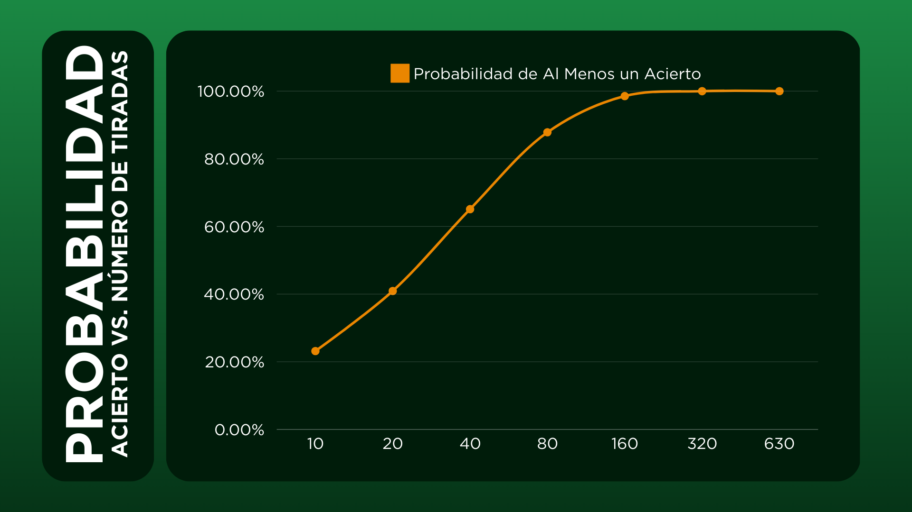

## **Triángulo de Pascal**

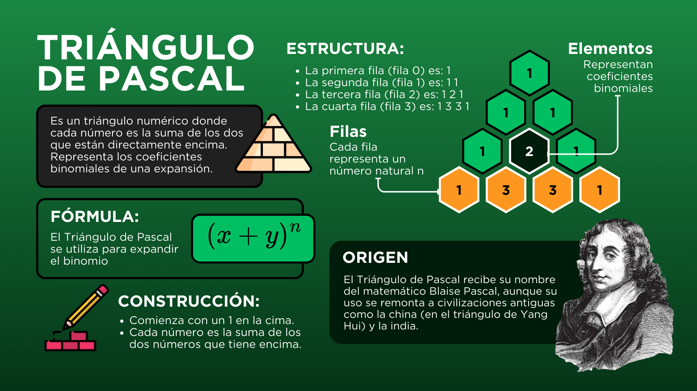

Los coeficientes binomiales también se pueden obtener utilizando el **triángulo de Pascal**, que es una herramienta visual para encontrar los coeficientes sin necesidad de cálculos factoriales.

Para 10 tiradas (expansión de $(x + y)^{10}$), los coeficientes binomiales son:

$$
1, 10, 45, 120, 210, 252, 210, 120, 45, 10, 1
$$

Estos coeficientes se utilizan para calcular las probabilidades de que ocurran desde 0 hasta 10 aciertos.

### **Gráfico: Triangulo de Pascal en 10 tiradas**

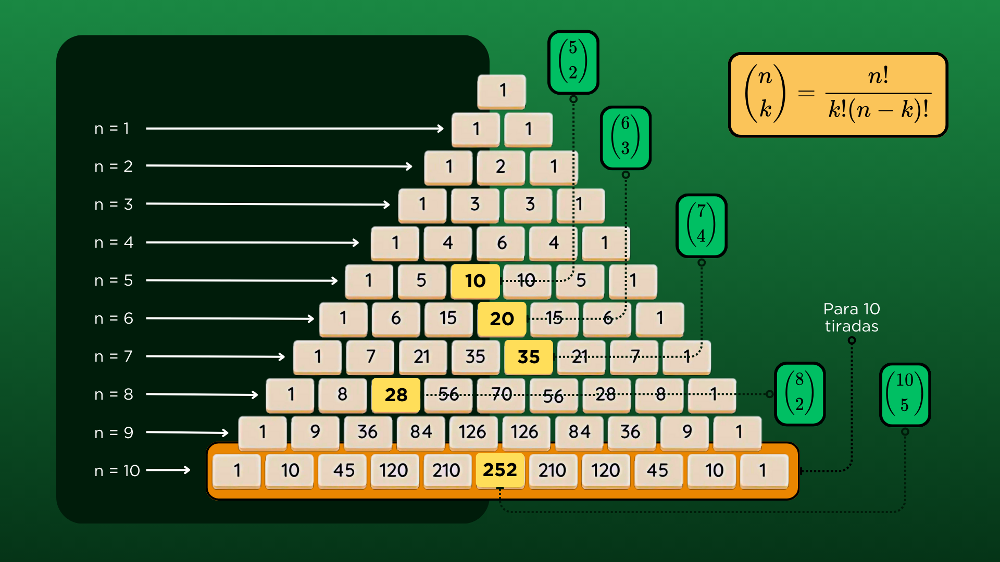

# **Ejecución del Proyecto**

A continuación se presentan algunas capturas de la ejecución del proyecto:

**Pantalla inicial**

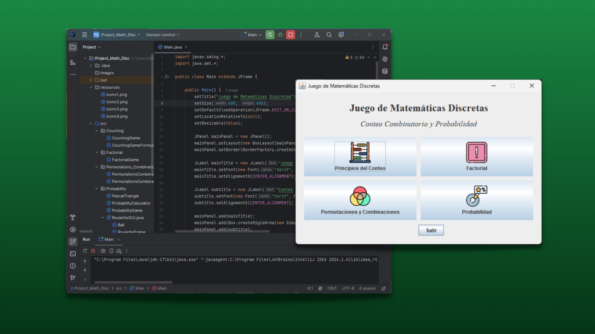

**Interfaz de los principios del conteo**

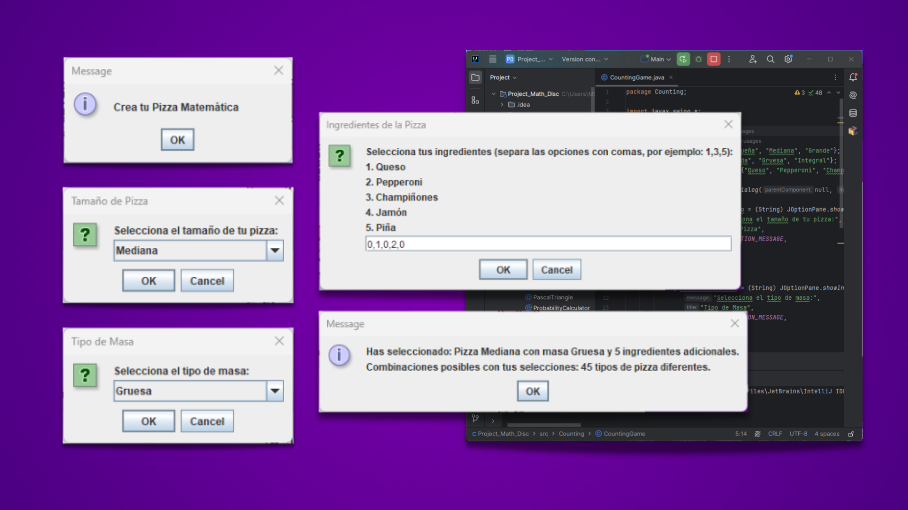

**Interfaz de cálculo de factorial**

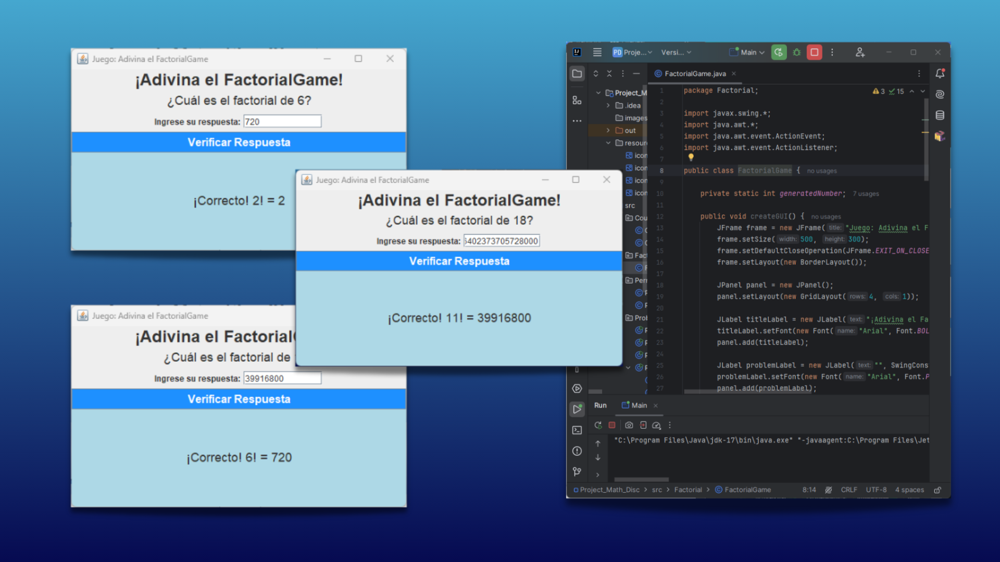

**Interfaz de cálculo de Permutaciones y combinatoria**

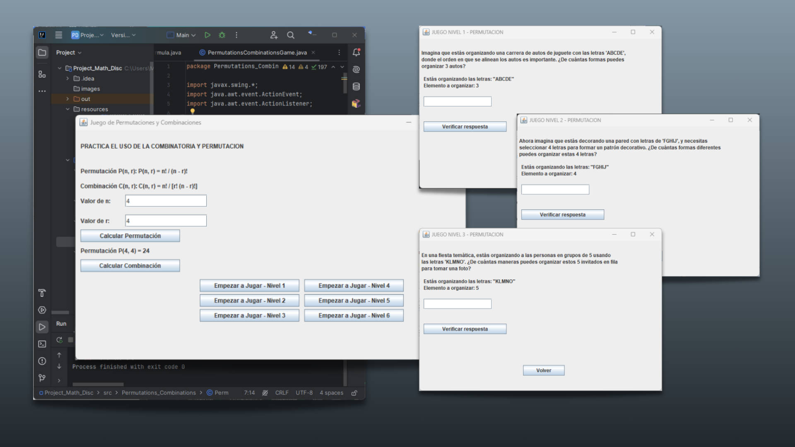

**Interfaz de cálculo de Probabilidad**

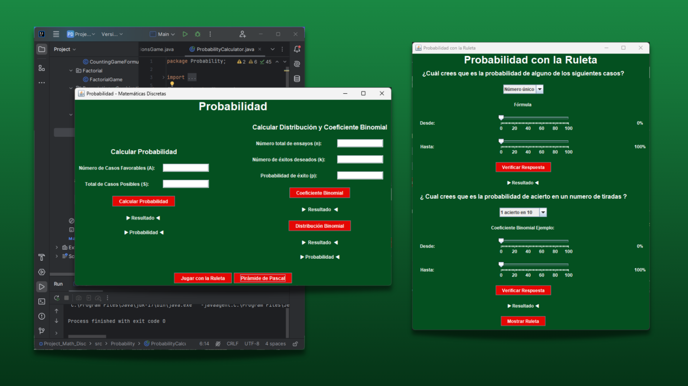

**Simulación de la Ruleta y Pirámide de Pascal**

